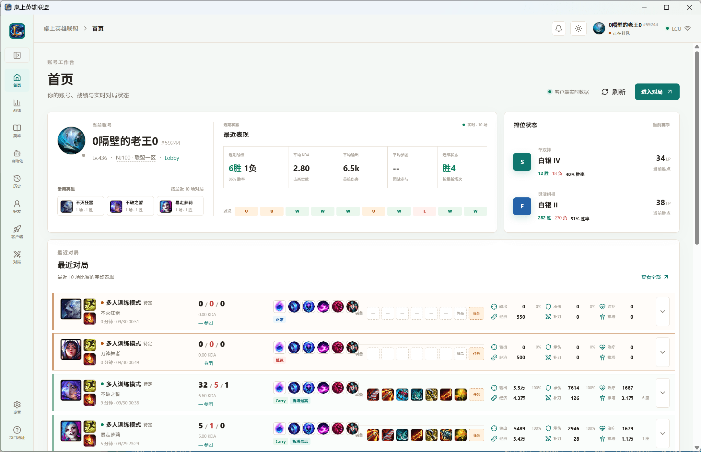
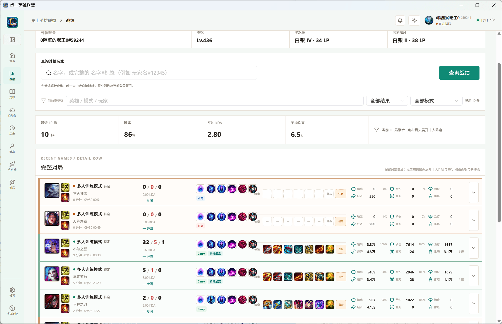
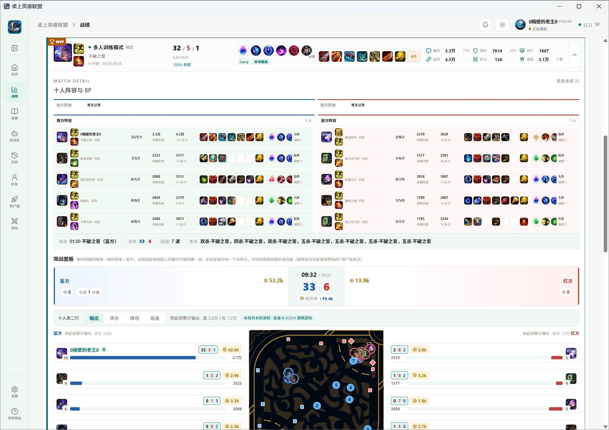
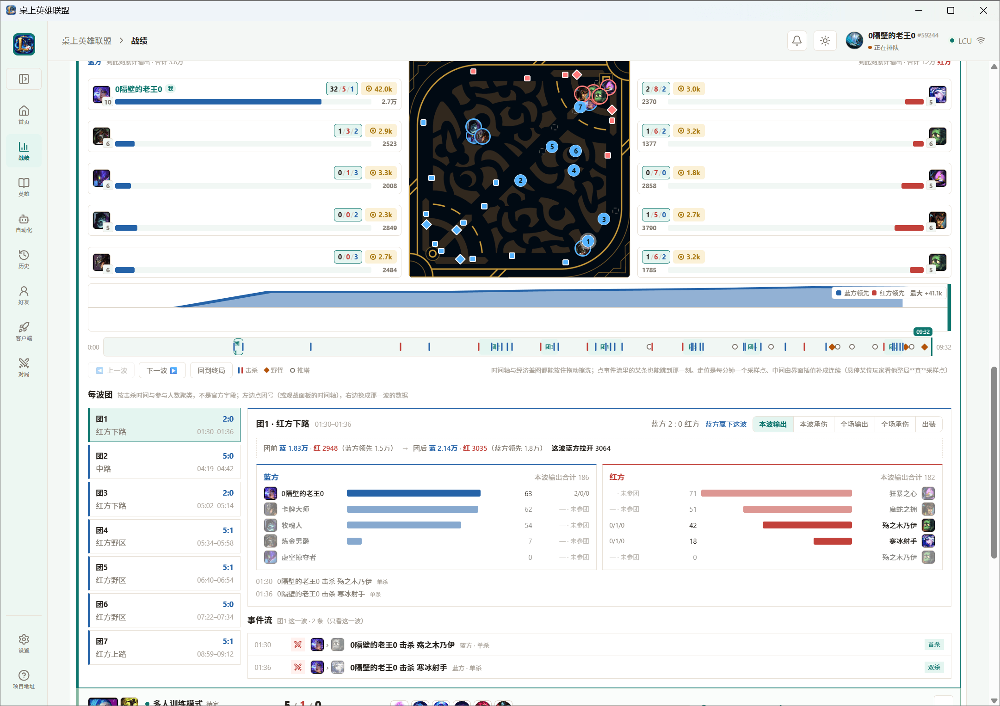
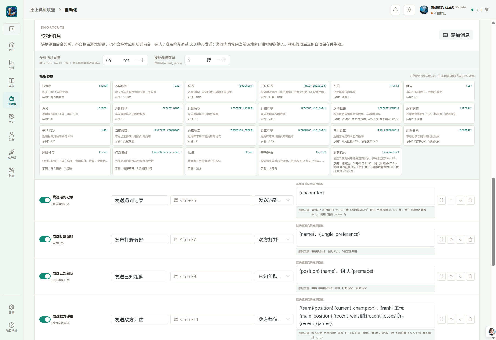
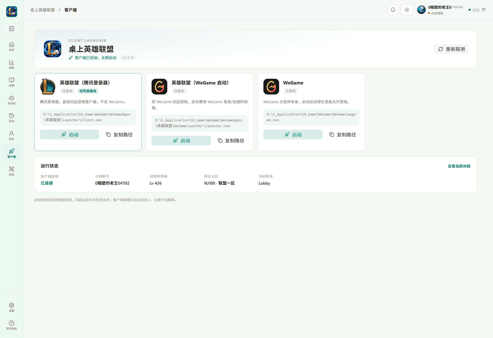

<div align="center">

# 桌上英雄联盟 · Native

《英雄联盟》客户端的桌面伴侣。查战绩、看对局、找玩家、发消息，全部离线直连本机客户端。

基于 [Native SDK](https://github.com/vercel-labs/native) —— Zig 原生宿主 + Vue 3 界面，
**不引入 Electron**。

[](#安装)
[](docs/changes/CHANGELOG.md)

</div>

---

## 这是什么

一个常驻在本机的 LoL 助手。它**不读取游戏内存、不注入、不改客户端文件**——所有数据都来自
官方客户端自己在本地开的那几个接口（LCU 与 Live Client Data），加上 Riot 的公开战绩服务。

这意味着两件事：**不封号**（用的是官方接口，和客户端自己在做的事一样），
以及**必须开着客户端**（它没起来时页面会明确告诉你，而不是显示一份假数据）。

## 功能

<table>
<tr><td width="50%" valign="top">

**首页** — 今天的战况一眼看完



</td><td width="50%" valign="top">

**战绩** — 逐局明细，可按英雄/模式筛



</td></tr>
<tr><td valign="top">

**对局详情** — 十人阵容与 BP、观战面板、事件流



</td><td valign="top">

**对局分析** — 逐分钟走位、经济曲线、每波团



</td></tr>
<tr><td valign="top">

**自动化** — 快捷消息、事件响应、定时动作



</td><td valign="top">

**客户端** — 启动器与连接状态



</td></tr>
</table>

### 展开说说

- **对局分析**：十人阵容、符文、装备、K/D/A 与团队占比；地图上的**逐分钟走位**（真实采样点与插值
  分开呈现）；**每波团**自动从击杀事件推导，可切换看输出、承伤、经济与出装。
  阵亡的圆点会灰化、读秒，并**钉在倒地处不动**。
- **玩家查询**：输入 `名字#编号` 即可跨大区查人（不用先选大区），支持**英雄俗称**搜索
  （输入「瞎」能找到盲僧）。等级与段位支持批量查询。
- **对局录制**（可选，默认关）：在本机打的时候按固定间隔采样，事后能拖动时间轴回看这一局的
  走位、装备与 KDA 变化。**只录你自己在打的局**，数据全在本机，只留最近几局。
- **实时状态**：好友的在线状态与「正在玩什么」只有好友列表拿得到——这是接口本身的边界，
  陌生人的实时状态在本地没有端点。

## 安装

从 [Releases](https://github.com/NOBB2333/LOL-desktop-native/releases) 下载
`lol-desktop-native.exe`，双击即可。

- 单个 exe，前端资源与 WebView2 加载器都已嵌入，**不需要额外安装运行时**。
- 默认**请求管理员权限**——因为游戏通常以管理员运行，不对齐的话游戏内快捷发送会被系统拦截。
  可以在设置里关掉，代价是游戏内发送可能失效。
- 需要 **Windows 10/11**（WebView2 已内置在 Win11，Win10 若缺失会自动提示安装）。

## 开发

需要 **Node.js 24.15.0**（见 `.node-version`）、**pnpm 12**、**Zig 0.16** 和 Native SDK CLI。

> 前端依赖**必须**用 pnpm：仓库提交的是 `frontend/pnpm-lock.yaml`。
> 用 `npm install --prefix frontend` 会把仓库根的 `package.json` 以
> `"lol-desktop-native-root": "file:.."` 写进 `frontend/package.json`，每次安装都会复发。

```sh
pnpm install
pnpm run frontend:dev      # 只起 Vite；浏览器预览自动走 fixture，不用开客户端
zig build dev -Dplatform=windows   # 起 Native WebView 壳
```

常用入口统一收在仓库根的 `package.json`：

| 命令 | 用途 |
|---|---|
| `pnpm run check:static` | 版本 + 命令面 + lint + `vue-tsc`，秒级，提交前跑 |
| `pnpm run check` | `check:static` + 后端测试 + 前端测试 |
| `pnpm run test` / `test:sandbox` | 后端测试（后者是沙箱环境的替代路径） |
| `pnpm run frontend:build` / `frontend:test` | 前端构建 / 测试 |
| `pnpm run version:set 3.0.0` | 改版本并同步全部派生字段 |
| `pnpm run bridge:check` | 校验 `app.json` ↔ Zig 命令表 ↔ 前端调度器一致 |
| `pnpm run native:check` | `native check . --strict` |

没有 Windows SDK 时，可以用无窗口平台验证构建图：`zig build -Dplatform=null`。

Native SDK 路径、开发端口、LCU 探测超时、证书策略、更新检查地址等都读 `config/native.json`，
也可以显式传 `-Dnative-sdk-path=...`。应用运行时不依赖项目自定义环境变量。

## 打包

```sh
zig build package -Dpackage-target=windows
native doctor --strict
```

也可以直接双击 `scripts/build.cmd`（macOS/Linux 用 `scripts/build.sh`）。产物：

```text
zig-out/package/lol-desktop-native.exe
```

首次启动会自动解包到 `%LOCALAPPDATA%/lol-desktop-native/runtime/<版本>-<内容哈希>`，
因此 exe 不依赖旁边的 `resources/` 或 DLL。

## 项目结构

```text
src/
  main.zig              宿主入口、窗口与权限策略
  backend.zig           命令表（唯一真相来源）、运行时与 handler 注册
  backend/              各功能模块（录制、技能、资产、自动化、事件…）
  lcu/                  LCU lockfile 发现与 loopback HTTPS
  storage/              SQLite（配置与各类缓存）
frontend/
  src/views/            页面
  src/components/       组件
  src/services/         桥接层：native.ts（真机） / browserBackend.ts（预览 fixture）
docs/
  README.md             文档地图（该看哪份、哪份已过期）
  design/               现行约定（改代码前先读）
  reports/              阶段性报告（带日期，写完即定型）
  changes/              变更记录
  archive/              历史归档
  image/                README 用图
```

## 文档

全部文档的地图（哪份是现行约定、哪份已过期）见 **[docs/README.md](docs/README.md)**。
常读的几份：

- **[界面不变量](docs/design/界面不变量.md)** — 时间线、阵容配对、观战面板、每波团、
  技能面板的硬约定。**动这些代码前先读这份**。
- **[明确不做的功能](docs/design/明确不做的功能.md)** — 哪些不做、为什么不做。
  每条同时标出了可扩展落点：不做是产品取向，不是做不到。
- **[变更记录](docs/changes/CHANGELOG.md)** — 各版本做了什么。
- **[架构评估](docs/reports/架构评估_2026-09-13.md)** — 后端竖切的决策过程。
- **[时间线调研](docs/reports/时间线调研_2026-09-24.md)** — 赛事级时间线的数据源证据。
  核心结论：本地接口**没有**伤害数据，「某一波团的输出」必须换到 SGP 的 `DETAILS`。
- **[改造方案与执行记录](docs/reports/改造方案与执行记录_2026-09-22.md)** — 版本单一源与命令面一致性防线。

## 版本与命令面

**应用版本只有一个手工维护来源：`app.json` 的 `version`。** 用
`pnpm run version:set <SemVer>`（**必须三段**）修改，它会同步 `package.json`、
`build.zig.zon`、`package-lock.json` 和浏览器预览 fixture 等派生字段；
`pnpm run version:check` 会断言 `src/` 下没有硬编码的当前版本字面量。

> 打包 CI 会断言 git tag 等于 `v` + `app.json.version`——只打 tag 不 bump 会直接失败。

**命令面只有一个真相来源：`src/backend.zig` 的 `command_table`。** 每个命令的名字和并发通道
写在同一行，`command_names`、`commandLane()` 和 bridge policy 都从它派生。新增命令的顺序是：

1. `command_table` 加一行
2. `app.json` 的 `bridge.commands` 声明
3. 补前端适配函数与调度通道

`pnpm run bridge:check` 会校验三者一致（2026-09-22 之前没有这道防线，曾有 4 条命令注册了但清单
一直没声明）。

## 数据与隐私

数据目录由 `config/native.json` 的 `dataDirName` 决定，Windows 默认
`%LOCALAPPDATA%\lol-desktop-native\Data`（配置、SQLite、导出都在这里）。
WebView2 用户数据在 `...\Cache\WebView2`，不会在 exe 旁生成运行目录。

**LCU 令牌、lockfile、SQLite 连接和 Windows 输入模拟永远不进入页面。** WebView2 里的页面没有
`fs`、进程枚举、全局键盘钩子，也不能绕过 LCU 的自签名证书校验——所以这些逻辑必须在 Zig 层，
不能塞进 Vue 的 `fetch`。

对局录制默认**关闭**，只在你本机打的时候采样，数据只存本机。回放文件（`.rofl`）**不是必需依赖**，
不会被自动上传或下载。
