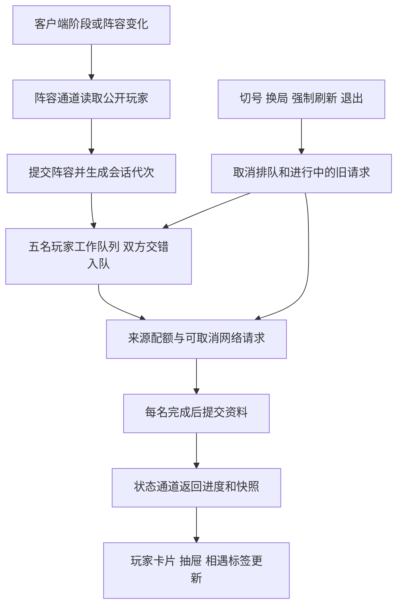

# 改造结果与验收方案

更新日期：2026-09-08。此文记录改造及敌方资料回归修正后的实际状态；初始问题及参考依据见 [综合评估](./PROJECT_ASSESSMENT_2026-09-08.md)。

本次修复三个相互影响的问题：全零 PUUID 被当作真实身份，资料发布未限定队伍与槽位，以及开局同人数时选人缓存挡住游戏内新公开的名字。现在空身份按完整名字补查，每次完成只更新所属槽位，合并对象互相独立。新公开的名字触发查询，身份补全本身不会反复取消整批。新版忽略旧版阵容缓存，已有原始战绩继续复用。

## 1. 已完成的改造

| 项目 | 当前实现 |
| --- | --- |
| 相遇判定 | 从已有战绩派生，不限制最近一年，不新建长期玩家档案；核验双方 PUUID、排除当前局、按比赛时间倒序，最多 40 局 |
| 相遇展示 | 标签悬停、聚焦与点击固定；显示日期、双方英雄、位置、KDA 和结果；卡片与抽屉共享列表 |
| 相遇详情 | 按 gameId 读取完整对局，缓存、LCU、支持地区的 SGP 依次回退；缺失时显示摘要并可重试，高亮双方 |
| 玩家加载 | 双方交错入队，最多五名玩家同时加载；同一玩家的段位与战绩并行；完成一名就发布所属槽位；原始战绩最多 50 场，卡片最多 20 场 |
| 刷新与结算 | 成功 60 秒刷新，缺失或失败 10 秒重试；手动强制刷新绕过玩家缓存，正常阶段交接复用未过期原始缓存；结算阶段可补近期战绩 |
| 排位开关 | 设置中的“仅显示排位数据”，默认关闭；开启后按 420、440 筛选单双排及灵活组排，先筛选再分页、截取样本及计算评分和消息；切换取消旧口径任务并刷新页面 |
| 阵容轮询 | 选人期间每 750 毫秒刷新阵容，其余实时阶段每 1500 毫秒；进度读取走独立状态通道，手动刷新先拉真实阵容 |
| 桥接调度 | 状态、阵容、普通查询、动作四条独立队列和工作线程；每条原生队列最多 64 个等待请求 |
| 共享状态 | 网络期间使用独占快照，只在复制或合并时持锁；保存设置不等待自动化网络请求 |
| 请求取消 | 排队动作绑定会话；创建快照时一并核验；网络、批次、输入提交前再次检查，切号、换局、强制刷新及退出取消过期工作 |
| 缓存归属 | 原有玩家战绩、段位及对局缓存按当前账号和大区隔离；平台名称统一大小写及腾讯前缀；未知归属的旧玩家缓存不混用 |
| 大区来源 | 参考 Akari，从客户端启动参数读取大区，兼容 --rso_platform_id 和 --rso-platform-id；仅有 lockfile 时再尝试接口 |
| 网络传输 | Windows 使用异步 WinHTTP；排队和网络共用总截止时间，取消后等最后关闭回调再释放上下文与缓冲区 |
| 来源配额 | 普通 LCU 6、远端 2、阵容预留 1、动作预留 1，总计最多 10 个 HTTP 请求；备用源认证在同批次内按需共用一次 |
| 错误与退避 | 区分认证、权限、不存在、限流、服务端错误和超时；429 对相应来源退避 2 秒 |
| 选人消息 | 整批文本合并为单次聊天请求，避免连续多次提交期间会话切换 |
| 游戏消息 | 每行文字一次注入；修饰键释放后输入；焦点丢失停止，失败不补提交回车，部分输入仅续发未完成事件 |
| 发送队列 | 前端最多四批、重复触发合并、超时取消；原生快捷键去重；前端和原生排队消息均绑定会话 |
| 发送防误触 | 默认开启且可关闭；只在单条消息输入期间屏蔽物理输入，每条结束或异常退出都恢复 |
| 数据真实性 | 无真实队伍构成数据时返回 null 并隐藏量表；评分改为基础 35、近期胜率 45、击杀助攻比 20，展示总分等于展示分项之和 |
| 窗口适配 | 按对局区域实际宽度调整布局；空间不足时总结栏移到下方，1180 像素窗口可完整呈现每队五张卡片 |
| 未接通入口 | 移除没有实际功能的 AI 设置和回看切换；旧回看设置启动时归一到实时，接口拒绝重新选择 |
| 内存与语言 | 请求参数、阵容复制和旧测试的 JSON 解析树及时释放；新增注释、测试说明和界面提示使用中文 |
| 工具链 | .node-version 固定 Node 24.15.0，声明依赖支持范围；沿用 Zig 0.16 和现有 Native SDK 打包方式 |

### 相遇的具体边界

Akari 有独立相遇索引，本项目按用户要求继续使用已有战绩样本。展示与排序参考它，但不承诺永久记住超过近期查询范围的相遇。旧相遇文件和数据库记录保留，退出新的运行时相遇读写路径。

普通相遇只要求某局同时存在本人和目标。只有双方的最新有效一局都等于该共同对局，才显示“上局队友”或“上局对手”。缺失结果显示待结算或不可用，不补零、不计为失败。

账号和平台隔离作用于既有缓存，不增加人物长期档案。首次改用有归属的缓存时可能需要重新读取战绩；公共配置与英雄资源继续共用。

### 加载和调度



无真实 PUUID 时先补查身份，之后段位与战绩同时请求。客户端已有有效战绩时直接使用；需要备用来源的玩家共用一次认证准备，取消期间等待认证的线程也会退出。英雄和队列静态资源复用缓存。当前按玩家发布；加载期间前端每 750 毫秒读取轻量进度和当前快照。

HTTP 配额与桥接线程数是两层限制。前端也为状态、阵容、普通查询及动作分别分配调用额度，避免战绩请求把前端允许的所有原生调用占满。

自动化继续使用已有独立看守线程和互斥保护，每次运行复制配置；配置改变后旧动作会被取消，下一轮按配置指纹重新发现连接。

## 2. 本地验证结果

| 检查 | 结果与范围 |
| --- | --- |
| 前端测试 | 21 个文件、94 项通过，新增五名空身份敌人乱序补全、稳定卡片键、排位筛选和设置迁移 |
| 原生测试 | 158 项通过，新增空身份判定、五个槽位独立发布、开局缓存交接、排位分页及切换取消 |
| 静态检查 | Vue 类型检查、代码检查、Native 严格清单检查通过 |
| 网络受控验证 | 实际调用 WinHTTP，验证成功、大响应、多段读取、401/403/404/500、容量限制、超时、取消、429 退避 |
| 网络到达检查 | 在执行前已取消及处于退避期的请求，没有抵达受控服务器 |
| 十人原生链路 | 实际执行阵容转换、九次名字补查、二十次段位与战绩请求、队列及发布；峰值六个请求并发，八名玩家的段位和战绩有重叠；慢首人不阻挡其他玩家 |
| 受控耗时 | 人为设置身份 120 毫秒、段位 180 毫秒、战绩 260 毫秒，其中一人战绩 1200 毫秒；首名约 467 毫秒，十人约 1492 毫秒，身份、英雄和战绩逐人核验 |
| 超时样本 | 100 毫秒配置的延迟响应约 124 毫秒退出；120 毫秒配置的持续慢响应约 141 毫秒退出，包含关闭回调收尾 |
| 浏览器 | 1440×900、1180×720 检查相遇浮层、固定展开、详情重试、双方高亮、设置入口和十人演示阵容 |
| 增量响应 | 第一轮受控五人、十人响应验证卡片逐步更新及已打开抽屉同步 |
| 排位交互 | 1440×900、1180×720 验证自动保存、十人样本过滤及关闭恢复，无重复键警告和页面错误 |
| Windows 构建 | 原生构建与 ReleaseFast 分发打包通过，产物见下方 |

以上结果是相应测试环境中的证据，不是全部真实对局的性能承诺。

## 3. 只读客户端验证

本次回归修正后，EndOfGame 阶段实测：连接 103 毫秒、十人阵容 1088 毫秒、资料批次 1933 毫秒，十人全部完成且无缺失资料、无重复身份。阵容和资料两阶段合计约 3 秒。另一个战绩列表查询为 177 毫秒。验证器使用空的应用内存数据库，客户端内部缓存状态未控制。这仍是结算阶段单次样本，不等于真实选人到开局的延迟分布。

以下为前一轮的只读样本，保留用于比较验证范围：

本轮检测到正在运行的英雄联盟客户端，实际调用本项目的后端并发入口读取连接、阵容和战绩。验证器使用内存数据库，不调用发送、删除或自动化命令，也不输出凭据、玩家标识及原始战绩。

客户端处于 EndOfGame 阶段时，一次冷缓存样本：

| 读取内容 | 结果 | 耗时 |
| --- | --- | --- |
| 连接 | 已连接 | 93 毫秒 |
| 当前阵容 | 10 人 | 1058 毫秒 |
| 本人战绩 | 10 场 | 3521 毫秒 |

此验证发现并修复了“段位接口不返回平台导致缓存归属无法确认”的真实兼容问题。平台改从启动参数取得，和参考项目一致。

这不是五人选人或十人开局的基准测试，也没有测过真实聊天发送。不能用上述单次数据计算 P95。

## 4. 构建与复验

本轮分发构建：

```text
zig-out/package/lol-desktop-native-2.0.0-windows-ReleaseFast/bin/lol-desktop-native.exe
```

产物沿用现有资源嵌入和 WebView2 打包机制。构建过程中没有关闭用户运行中的应用，也没有替换旧的根目录单文件产物。

在项目根目录执行以下命令；SDK 路径用本机实际安装位置替换：

```powershell
npm test --prefix frontend
npm run typecheck --prefix frontend
npm run lint --prefix frontend
native check . --strict
zig build test -Dplatform=null -Dnative-sdk-path=<SDK路径>
zig build package -Dplatform=windows -Dpackage-archive=false -Dnative-sdk-path=<SDK路径>
node scripts/verify-network.mjs -Dnative-sdk-path=<SDK路径>
zig build verify-runtime -Dplatform=null -Dnative-sdk-path=<SDK路径>
```

最后一条只读访问正在运行的客户端；倒数第二条自建本地受控 HTTP 服务。验证器仅允许指定回环测试地址。

本次浏览器预览：`http://127.0.0.1:49175/#/game`，使用演示数据。排位开关验证脚本为 `.zig-cache/review-2026-09-08/verify-ranked-ui.cjs`，截图为同目录的 `ranked-*.png`，不作为业务代码提交。

## 5. 仍需真实使用验收

以下场景需要正在进行的游戏和用户实际操作，本轮没有自动执行：

1. 真实五人选人、十人开局，分别记录冷缓存和热缓存的阵容、首名玩家、全部结束耗时。
2. 选人聊天和游戏内多条消息，在移动、按住修饰键、切换窗口、权限不同等场景下检查发送及输入恢复。
3. 连续多局、秒退、重开、切号、同账号转区，确认没有旧资料覆盖和旧消息补发。
4. 连续运行 30 至 60 分钟，观察内存、线程数、请求队列和客户端重启恢复。
5. 独立安装目录中启动分发包，验证 WebView2、管理员权限及用户数据路径。

真实聊天在服务端已收到、但响应丢失时，无法仅凭客户端超时确认是否已发送；本项目不会自动重放这种发送。

## 6. 可选的下一阶段

这些属于进一步优化，不是当前入口显示为已实现的能力：

- 在玩家内部按字段发布，按关注对象提高任务优先级，以进一步缩短首批可用信息等待。
- 将目前的批次耗时扩展为逐请求排队、网络、解析和缓存来源诊断；积累足够样本后报告中位数和 P95。
- 将当前轮询快照改为合并后的原生增量事件，减少大型阵容快照的传输和解析。
- 基于可靠英雄数据另行设计阵容评分；需要回看或 AI 时再实现完整数据源、错误恢复和产品流程。
- 非 Windows 的 curl 回退仍只在请求前检查取消、通过进程超时退出；若未来要正式支持该平台，再补原生取消和来源配额。
